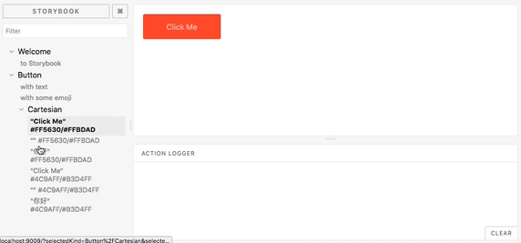

## Storybook Cartesian

Automatically generate stories for all of your component variants.



See more about this example in [examples/app](examples/app).


## Quick Start

Install:

```
$ yarn add --dev storybook-cartesian
```


To integrate in your own project, add to your stories:

```javascript
import cartesian from 'storybook-cartesian'
cartesian(storiesOf('Button/Cartesian', module))
  .add(() => ({
        colors: [
            { bg: '#FF5630', fg: '#FFBDAD' }, 
            { bg: '#4C9AFF', fg: '#B3D4FF' }
        ],
        text: ['Click Me', '', '你好']
    }),
    props => `"${props.text}" ${props.colors.bg + '/' + props.colors.fg}`,
    props => <Button 
                style={{ 
                    padding: '1em 3em', 
                    border: 'none', 
                    backgroundColor: props.colors.bg, 
                    color: props.colors.fg 
                }}>
                {props.text}
            </Button>
  )
```

## Basics

The general structure for `cartesian` is this:

```javscript
cartesian(<stories>)
    .add(
        <seed function>,
        <title renderer>,
        <component renderer>,
        <valid combination filter (optional)>,
        <story apply function (optional)>
    )
```

Your `seed` function is responsible to generate content in the form of:

```javascript
// if this is a sample of your props:
const props = {
    one: "hello",
    two: "foobar"
    check: true
}

// then this is your seed function:
const seedfn = ()=>({
    one: ["hello", "another"],
    two: ["foobar"]
    check: [true, false]
})
```

Your `titleRender` function gets an instance of your props and returns a string:

```javascript
const titleRender = props => `${props.one} / ${props.check}`
```

Your `storyRender` function gets an instance of your props and returns a component:

```jsx
const componentRender = props => <Button {...props} />
```

And to compose all of these with `cartesian` we can now do:

```javascript
cartesian(storiesOf('Button/Cartesian'))
    .add(
        seedfn,
        titleRender,
        componentRender
    )
```


## Advanced

Some times, not all prop combinations make sense. For example if you have an `isLoading` and a `results` props it doesn't make
sense to have both `true` and `results` populated:

```javascript
// doesn't make sense
<SearchResults isLoading={true} results={['hello', 'world']}>
```

For this, we have an `valid` function that we can add, and the following will filter out this invalid combination:

```javascript
cartesian(storiesOf('Button/Cartesian'))
    .add(
        seedfn,
        titleRender,
        componentRender,
        props => !(props.isLoading && props.results)
    )
```

Some other times you might want to customize how you add stories. For this, we have another optional function:

```javascript
cartesian(storiesOf('Button/Cartesian'))
    .add(
        seedfn,
        titleRender,
        componentRender,
        () => true, // keep it as the default
        (stories, candidate)=>{
            console.log('adding to stories', candidate.props)
            stories.add(candidate.title, candidate.story)
        }
    )
```

# Contributing

Fork, implement, add tests, pull request, get my everlasting thanks and a respectable place here :).

### Thanks:

To all [Contributors](https://github.com/jondot/storybook-cartesian/graphs/contributors) - you make this happen, thanks!

# Copyright

Copyright (c) 2018 [Dotan Nahum](http://gplus.to/dotan) [@jondot](http://twitter.com/jondot). See [LICENSE](LICENSE.txt) for further details.
