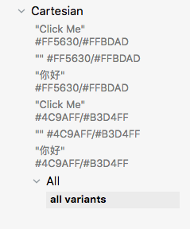
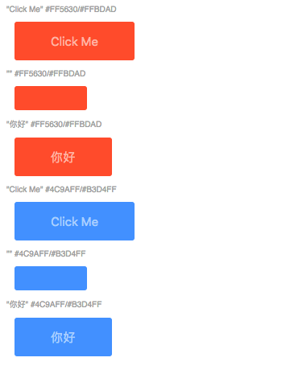

## Storybook Cartesian

Automatically generate stories for all of your component variants.


See more about this example in [examples/app](examples/app).


<!-- START doctoc generated TOC please keep comment here to allow auto update -->
<!-- DON'T EDIT THIS SECTION, INSTEAD RE-RUN doctoc TO UPDATE -->


- [Storybook Cartesian](#storybook-cartesian)
- [Quick Start](#quick-start)
- [Basics](#basics)
- [Advanced](#advanced)
  - [Beautiful names for variants](#beautiful-names-for-variants)
  - [Validating Variants](#validating-variants)
- [Contributing](#contributing)
  - [Thanks](#thanks)
- [Copyright](#copyright)

<!-- END doctoc generated TOC please keep comment here to allow auto update -->

## Quick Start

Install:

```
$ yarn add --dev storybook-cartesian
```


To integrate in your own project, add to your stories:

```javascript
import cartesian from 'storybook-cartesian'
cartesian(storiesOf('Button/Cartesian', module))
  .add(() => ({
        colors: [
            { bg: '#FF5630', fg: '#FFBDAD' }, 
            { bg: '#4C9AFF', fg: '#B3D4FF' }
        ],
        text: ['Click Me', '', '你好']
    }),
    props => `"${props.text}" ${props.colors.bg + '/' + props.colors.fg}`,
    props => <Button 
                style={{ 
                    padding: '1em 3em', 
                    border: 'none', 
                    backgroundColor: props.colors.bg, 
                    color: props.colors.fg 
                }}>
                {props.text}
            </Button>
  )
```

## Basics

The general structure for `cartesian` is this:

```javscript
cartesian(<stories>)
    .add(
        <seed function>,
        <title renderer>,
        <component renderer>,
        <valid combination filter (optional)>,
        <story apply function (optional)>
    )
```

Which gets you this kind of story layout _generated automatically_ (for now the last "All/all variants" is a story discussed in [Advanced](#advanced)):



Your `seed` function is responsible to generate content in the form of:

```javascript
// if this is a sample of your props:
const props = {
    one: "hello",
    two: "foobar"
    check: true
}

// then this is your seed function:
const seedfn = ()=>({
    one: ["hello", "another"],
    two: ["foobar"]
    check: [true, false]
})
```

If you want to have just a selection of props be cartesian you can use the special `choice` function:

```js
import cartesian, { choice } from 'cartesian'

const seedfn = ()=>({
    one: "rabbit",
    two: "rabbit, rabbit",
    check: choice(true, false)
})
```

This will create a special data strucure which tells `cartesian` to create these combinations:

```js
[{
    one: "rabbit",
    two: "rabbit, rabbit",
    check: true
},{
    one: "rabbit",
    two: "rabbit, rabbit",
    check: false
}]
```


Your `titleRender` function gets an instance of your props and returns a string:

```javascript
const titleRender = props => `${props.one} / ${props.check}`
```

Your `storyRender` function gets an instance of your props and returns a component:

```jsx
const componentRender = props => <Button {...props} />
```

And to compose all of these with `cartesian` we can now do:

```javascript
cartesian(storiesOf('Button/Cartesian'))
    .add(
        seedfn,
        titleRender,
        componentRender
    )
```


## Advanced

### Beautiful names for variants

If you'd like prop values to have logical names, try `renderWithLegend`:

```js
import cartesian, { renderWithLegend } from 'cartesian'

const complex = { foo:1, bar: 2 }
complex.toString = () => 'complex-1'

const renderTitle = renderWithLegend({
  '#FF5630': 'primary',
  '#FFBDAD': 'secondary',
  '#4C9AFF': 'primary-opt',
  '#B3D4FF': 'secondary-opt',
  'Click Me': 'english',
  [complex]: 'complex object',
  '': 'empty',
  '你好': 'chinese'
})

cartesian(storiesOf('Button/Cartesian (legend)', module))
  .add(() => ({
    colors: [{ bg: '#FF5630', fg: '#FFBDAD' }, { bg: '#4C9AFF', fg: '#B3D4FF' }],
    text: ['Click Me', '', '你好']
  }),
    renderTitle(props => `"${props.text}" ${props.colors.bg + '/' + props.colors.fg}`),
    props => <Button style={{ padding: '1em 3em', border: 'none', backgroundColor: props.colors.bg, color: props.colors.fg }}>{props.text}</Button>
  )
```

`renderWithLegend` takes a legend dict, that maps actual prop values to the ones you give in the legend. 

Then, it takes a normal renderTitle function that you supply, and it will make sure prop values will be legend values.

If you want just a top level legend translation (not going into all values in a data structure) use `renderWithLegendFlat`.

### Validating Variants

Some times, not all prop combinations make sense. For example if you have an `isLoading` and a `results` props it doesn't make
sense to have both `true` and `results` populated:

```javascript
// doesn't make sense
<SearchResults isLoading={true} results={['hello', 'world']}>
```

For this, we have an `valid` function that we can add, and the following will filter out this invalid combination:

```javascript
cartesian(storiesOf('Button/Cartesian'))
    .add(
        seedfn,
        titleRender,
        componentRender,
        props => !(props.isLoading && props.results)
    )
```

Some other times you might want to customize how you add stories. For example, let's say you want just one story to contain all cartesian product items. 





For this, we have another optional function:


```javascript
const allVariantsInOne = (stories, variants)=>{
    const story = variants.map(c=>(
        <div>
            <div>{c.title}</div>
            <div>{c.story}</div>
        </div>))
    stories.add('all variants', ()=> story)
}

cartesian(storiesOf('Button/Cartesian'))
    .add(
        seedfn,
        titleRender,
        componentRender,
        () => true, // keep it as the default
        allVariantsInOne,
    )
```

## Contributing

Fork, implement, add tests, pull request, get my everlasting thanks and a respectable place here :).

### Thanks

To all [Contributors](https://github.com/jondot/storybook-cartesian/graphs/contributors) - you make this happen, thanks!

## Copyright

Copyright (c) 2018 [Dotan Nahum](http://gplus.to/dotan) [@jondot](http://twitter.com/jondot). See [LICENSE](LICENSE.txt) for further details.
